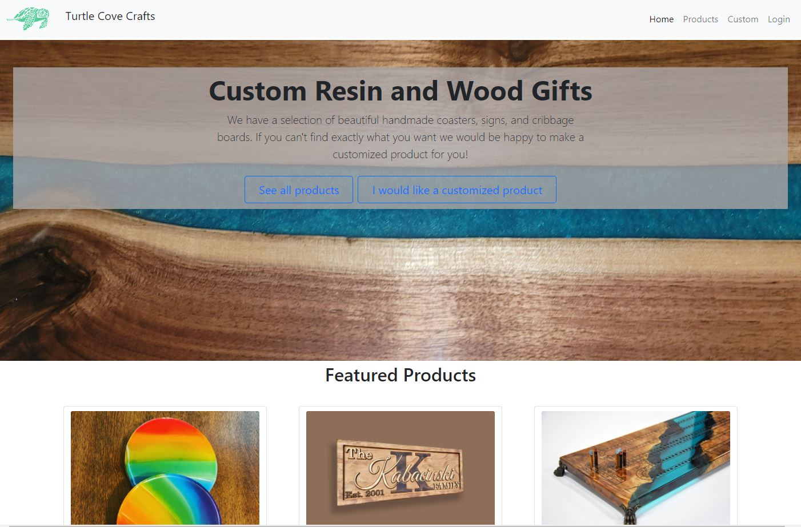
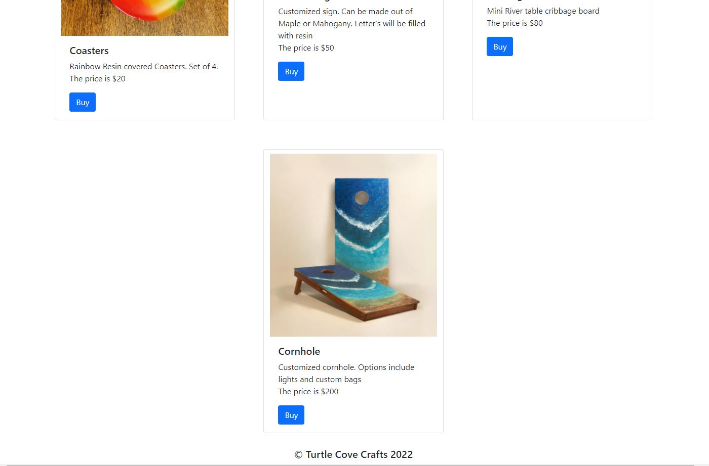
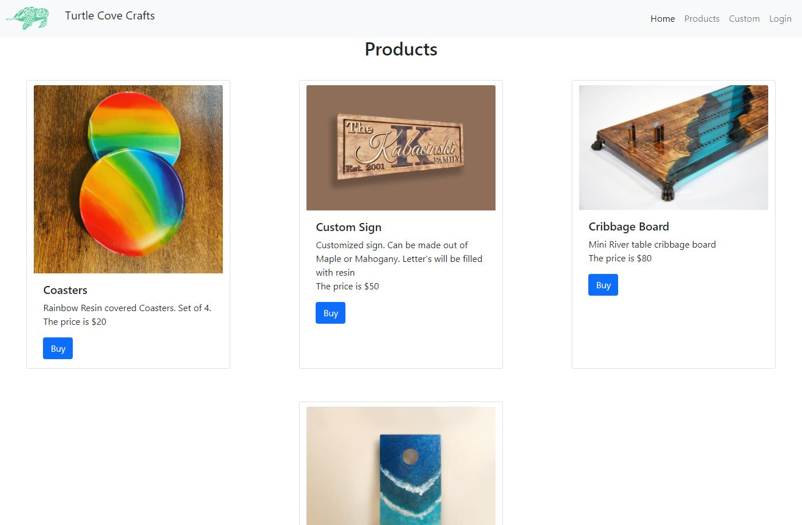
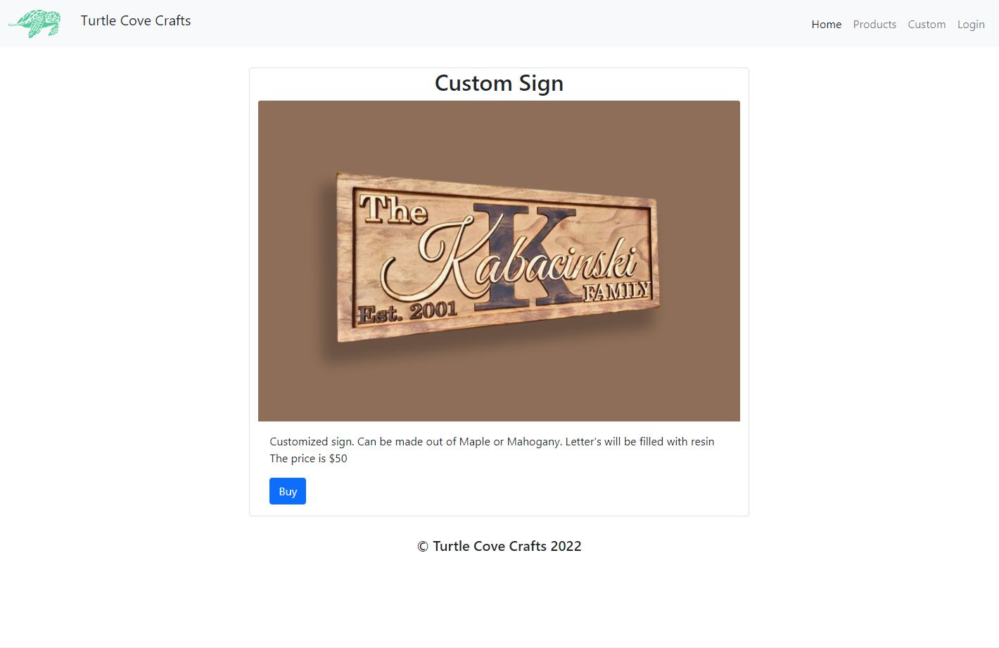
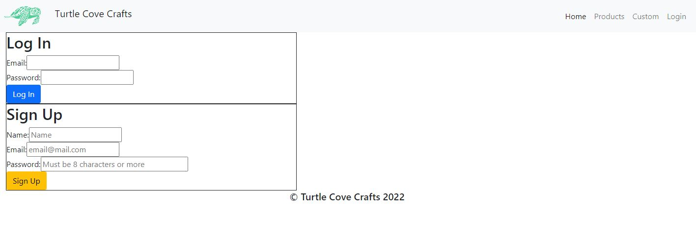
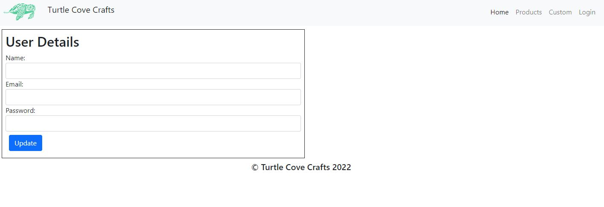
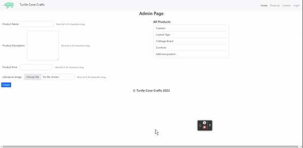

 # Turtle Cove Crafts

  ## Description

  Website for a local business that sells products online.
  
  ## Table of Contents

- [Description](#description)
- [Installation](#installation)
- [Usage](#usage)
- [License](#license)
- [Contributing](#contributing)
- [Tests](#tests)
- [Questions](#questions)

## Installation

Run npm install to install all dependencies for this project.

## Usage

This website allows this business to show their prodocts that are availible to buy. There is an ability to create an account and access the admin page. On the admin page you can seem all the availible products and edit their details and update the picture of the product. The product and the image is saved to a MongoDB database. You can view all the products in a list or when you click on it you can only see that product.

## Images
### Homepage

### All Products page

### Single Product Page

## Login Page

### Profile Page

### Admin Page

## Questions

If you have any questions you can find me on Git hub at [m-ray-ofSunshine](https://github.com/m-ray-ofSunshine)

You can also email me at n/A
